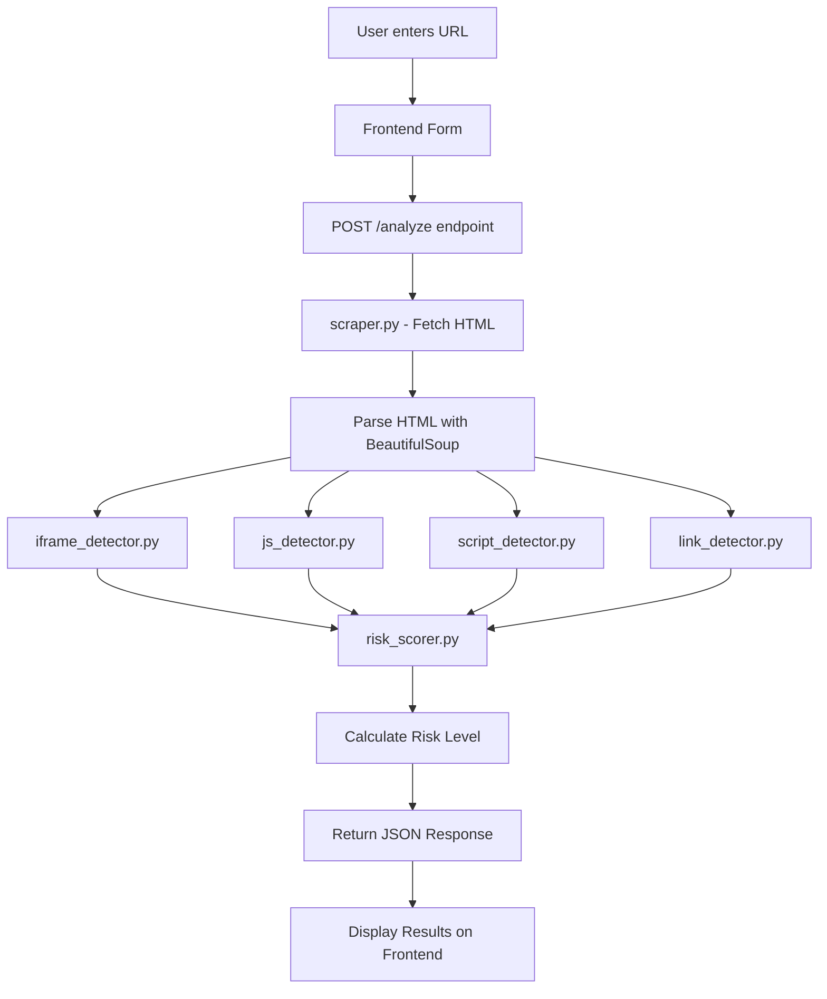

# Malicious Webpage Behavior Detection System - Architecture Document

## Project Overview

A web-based system that analyzes webpages for suspicious/malicious behavior patterns including hidden iframes, obfuscated JavaScript, external scripts from unknown domains, and dangerous file links.

## Technology Stack

- **Backend**: Python with Flask
- **Frontend**: HTML, CSS, JavaScript (vanilla)
- **Web Scraping**: `requests` + `BeautifulSoup4`
- **No Database**: Stateless design

## Project Structure

```
malicious-webpage-detector/
├── app.py                    # Flask application entry point
├── requirements.txt          # Python dependencies
├── config.py                 # Configuration settings
├── detectors/                # Detection modules
│   ├── __init__.py
│   ├── iframe_detector.py    # Hidden/suspicious iframe detection
│   ├── js_detector.py        # JavaScript obfuscation detection
│   ├── script_detector.py    # External script detection
│   ├── link_detector.py      # Dangerous file/link detection
│   └── risk_scorer.py        # Risk scoring engine
├── scraper.py                # Web scraping and HTML fetching
├── static/                   # Static assets
│   ├── css/
│   │   └── style.css         # Frontend styling
│   └── js/
│       └── main.js           # Frontend JavaScript
└── templates/
    └── index.html            # Main frontend page
```

## System Architecture



## Detection Modules Detail

### 1. Iframe Detector [`iframe_detector.py`](detectors/iframe_detector.py)

**Detects:**
- Hidden iframes: `width=0`, `height=0`, `display:none`, `visibility:hidden`, `opacity:0`
- Iframes pointing to suspicious/unknown domains
- Iframes with `sandbox` attribute misused

**Risk Weight:** HIGH

### 2. JavaScript Obfuscation Detector [`js_detector.py`](detectors/js_detector.py)

**Detects:**
- `eval()` usage
- `atob()` / `btoa()` (Base64 encoding/decoding)
- `String.fromCharCode()` patterns
- Hex-encoded strings: `\x41\x42...`
- Unicode escape sequences: `\u0041\u0042...`
- `document.write()` with encoded content
- Excessive string concatenation patterns

**Risk Weight:** HIGH

### 3. External Script Detector [`script_detector.py`](detectors/script_detector.py)

**Detects:**
- Scripts loaded from external domains
- Scripts from known malicious domains (blocklist)
- Scripts from newly registered or unknown domains
- Mixed content (HTTP scripts on HTTPS pages)

**Risk Weight:** MEDIUM

### 4. Dangerous Link Detector [`link_detector.py`](detectors/link_detector.py)

**Detects:**
- Links to sensitive files: `.git/`, `.env`, `.htaccess`
- Configuration files: `config.php`, `config.json`, `web.config`
- Backup files: `.bak`, `.backup`, `.old`, `.sql`, `.dump`
- Admin panels: `/admin`, `/wp-admin`, `/phpmyadmin`
- API keys/tokens in URLs

**Risk Weight:** MEDIUM-HIGH

## Risk Scoring Engine [`risk_scorer.py`](detectors/risk_scorer.py)

### Scoring Logic

| Risk Level | Score Range | Color |
|------------|-------------|-------|
| LOW        | 0-25        | Green |
| MEDIUM     | 26-50       | Yellow |
| HIGH       | 51-75       | Orange |
| CRITICAL   | 76-100      | Red |

### Point Allocation

| Detection Type | Points per Finding |
|----------------|-------------------|
| Hidden iframe  | 25                |
| Suspicious iframe domain | 20      |
| eval() usage   | 20                |
| Base64 encoding (atob/btoa) | 15   |
| String.fromCharCode | 15           |
| Hex/Unicode encoding | 10          |
| External script (unknown) | 10     |
| External script (blocklisted) | 30 |
| Dangerous file link | 15           |
| Admin panel link | 10              |

## API Design

### POST `/analyze`

**Request:**
```json
{
  "url": "https://example.com"
}
```

**Response:**
```json
{
  "url": "https://example.com",
  "risk_level": "HIGH",
  "risk_score": 75,
  "findings": [
    {
      "category": "iframe",
      "severity": "high",
      "description": "Hidden iframe detected with display:none",
      "evidence": "<iframe src='https://evil.com' style='display:none'>"
    },
    {
      "category": "javascript",
      "severity": "high",
      "description": "Obfuscated JavaScript detected: eval(atob(...))",
      "evidence": "eval(atob('base64string'))"
    }
  ],
  "recommendations": [
    "Avoid visiting this site - may redirect to phishing page",
    "Obfuscated code may be hiding malware or keylogger"
  ]
}
```

### GET `/`

Returns the main HTML page with the analysis form.

## Frontend Design

### Components

1. **Input Section**
   - URL text input
   - Analyze button
   - Loading indicator

2. **Results Section**
   - Risk level badge (color-coded)
   - Risk score bar/visual
   - Findings list with descriptions
   - Recommendations section

3. **History Section** (optional, client-side only)
   - Recent scans stored in localStorage

## Security Considerations

- Use `requests` with timeout to prevent hanging
- Validate URL format before fetching
- Sanitize HTML output to prevent XSS in results display
- Rate limiting to prevent abuse
- User-Agent rotation to avoid blocking

## Dependencies

```
Flask==3.0.0
requests==2.31.0
beautifulsoup4==4.12.2
urllib3==2.1.0
```

## Setup Instructions

1. Install Python 3.8+
2. Create virtual environment: `python -m venv venv`
3. Activate: `venv\Scripts\activate` (Windows)
4. Install dependencies: `pip install -r requirements.txt`
5. Run: `python app.py`
6. Open: `http://localhost:5000`

## Future Enhancements (Out of Scope)

- Database for scan history
- Screenshot capture of analyzed page
- Real-time monitoring mode
- Browser extension integration
- Machine learning-based detection
- API rate limiting with authentication
- Docker containerization
